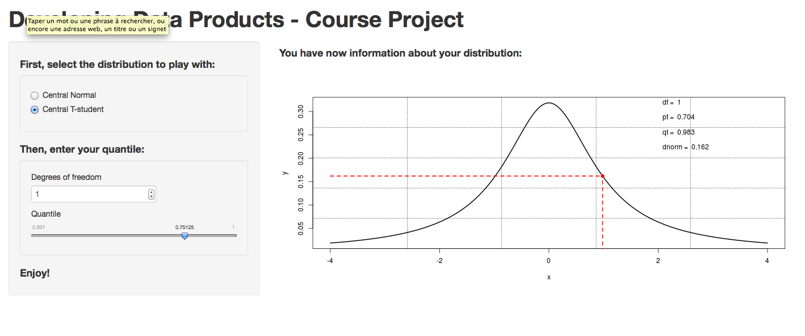

## Context

<br>
If you have follow all courses of the Data Science Specializiation, you probably realise to what extent <b>Central Normal Distribution</b> and <b>Central T-Student Distribution</b> were important.

Especially, quantile were often calculted in order to answer quizz questions or to make our course project.

The goal of my shiny app application is precisely to calculate quantiles:
- <b>Faster</b>
- <b>Simplier</b>
- <b>Enjoyable</b>

<font size="+4"><b>This is a revolution!</font></b>

--- .class #id 

## Screenshot of the shiny application

<a href="https://florianlicari.shinyapps.io/CourseProjectApp/"> Link to the app </a>



--- .class #id 

## Central Normal Distribution Example: Code


```r
x <- seq(-4,4,0.001); y <- dnorm(x); q <- 0.95; x1 <- qnorm(q); y1 <- dnorm(qnorm(q))
plot(x,y,type="l",lwd=2)
lines(c(x1,x1),c(0,y1),col="red",lwd=2,lty=2)
lines(c(0-1*4,x1),c(y1,y1),col="red",lwd=2,lty=2)
points(x1,y1,col="red",pch=19)
text(2,max(y),paste("Mean = ",0),pos=4)
text(2,max(y)*0.9,paste("Sd = ",1),pos=4)
text(2,max(y)*0.8,paste("pnorm = ",
                        round(pnorm(q)),3),pos=4)
text(2,max(y)*0.7,paste("qnorm = ",
                        round(x1,3)),pos=4)
text(2,max(y)*0.6,paste("dnorm = ",
                        round(y1,3)),pos=4)
```

--- .class #id 

## Central Normal Distribution Example: Plot


